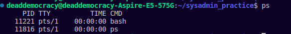

# Process Control

### Components of A Process

**Some important Points**

- Process contains an address space and a set of data structures within the kernel 
- Address spaces = memory pages marked by the kernel for process's use
- Internal data structures of the kernel keep track of various information about each process. Some of them are 
    - The process's address map
    - The current status of the process (sleeping, running, etc)
    - Execution priority of the process
    - Information about resource use (CPU, memory)
    - Information about the files and network ports
    - Information about which signals are blocked
    - Information about the process's owner

### Monitoring Processes: The `ps` command

1. Using `ps` without any flags
```
deaddemocracy@deaddemocracy-Aspire-E5-575G:~/sysadmin_practice$ ps
```
***Output (Ubuntu 20.04.5 LTS)***



2. `ps aux`

    - `a`: Show all processes
    - `u`: Show the results in a "user-oriented" format
    - `x`: Show process that dont even have a control terminal 

```
deaddemocracy@deaddemocracy-Aspire-E5-575G:~/sysadmin_practice$ ps aux | more
```

***Output***
